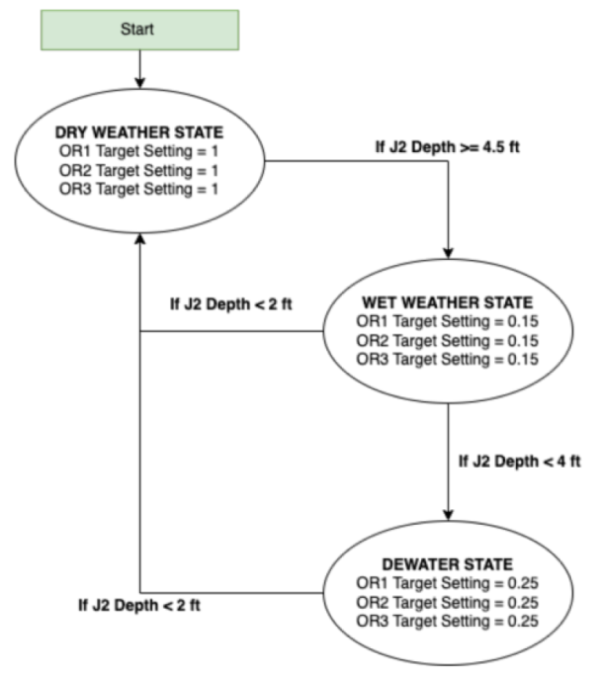

# About the SWMM Operations Dashboard

This web app provides a minimum working example (MWE) of an Azure Web App that runs a SWMM model based on user input for system controls and rainfall generation.

It leverages `PySWMM` and the associated `swmmio` libraries to install a Linux-based version of SWMM on a cloud VM. The model can be run with new inputs at the click of a button and generates summary graphics for relevant system nodes and metrics, and also generates a system profile map showing the results in terms of hydraulic grade line (HGL) for both a no-controls baseline and the selected user controls.

## SWMM Model

The SWMM model used in this example is borrowed from the PySWMM examples repository (Example 7 - "Espresso Machine"). The model specifies a simple interceptor system (see system map below):

The PySWMM authors provide the following system description:

"The model represents a combined sewer overflow (CSO) system where nodes J1 - J8 make up an interceptor system. We also have prescribed CSO points at OF1, OF2, and OF3. We also have large storage tanks upstream of each CSO point (SU1, SU2, and SU3). For each tank, if you surcharge it enough it will overflow the CSO. The problem begins with a series of large storm events. In our no-control simulation we see that all CSO tributary areas have unfettered flow to the interceptor system. The excess inflow exceeds the conveyance capacity of the interceptor (see following figure)."

The figure referenced is the initial figure presented on this app, displaying the flooding (SSO) at Junction 1 (J1), as the flow to the interceptor exceeds its capacity. The "No Control" line shows the resulting flows without any control settings adjusted during the simulation - all of the orifices are 100% open throughout the simulated storm event. The "Proposed Control" line shows the effects, in terms of flooding at J1, of the latest control settings submitted for evaluation. The initial state of the app is a setting that moderates the flooding to some extent, but does not eliminate it.

The goal for the simple use case of this web app is for the user to alter the control settings to eliminate the flooding at J1 and minimize total CSO discharges (cumulative inflows to OF1, OF2 and OF3). The simple control rules and their interpretation are provided below.

## Control rules and inputs
The system control inputs are three settings for the dynamic opening/closing of three control orifices downstream of an observation junction (Junction 2). The PySWMM library checks the depth at node J2 periodically throughout the simulation and adjusts the control setting of the control orifices according to the simple control rules defined in the app logic using PySWMM.

As explained by the PySWMM authors, "Through the use of some simple control we can start using the 3 storage tanks and throttling the underflow lines. The following control logic was applied to the model. This is a very trivial control example that uses a State Machine":

In other words, there are three possible system states in this logic: 
- Dry-weather state: 
    - The depth at the observation node (J2) is less than 2 feet, and all orifices are fully open 
    - From this state, the system can transition to the wet-weather state 
- Wet-weather state: 
    - The depth at J2 exceeds 4.5 feet, all orifices are set to 15% open 
    - From this state, the system can transition either to dry-weather state or to dewatering state 
- Dewatering state: 
    - The depth at J2 is less than 4 feet, orifices are set to 25% open 
    - From this state, the system can transition to dry-weather state

By adjusting the percent-open variable for each of these states, the application allows exploring different settings to find a preferred control policy for a given storm. The storm itself can be adjusted as described in the next section.

## Altering rainfall inputs
An additional interaction the user can have on the model within this app is to adjust the rainfall forcing the system response. The Boolean switch labeled "Generate New Rainfall?", if switched on, will generate a random perturbation to the initial rainfall series using an exponential distribution ($\lambda = 0.5$). A new simulation can then be run with the altered rainfall by pressing the "Run Simulation" button.

## Exploring simulation results
The dropdown selection option in the "Simulated Flows" tab allows the user to switch between viewing the flooding at J1, to viewing the cumulative inflows at various points of interest (J8, OF1, OF2, OF3). The "System Profile" tab provides a view of the system's maximum simulated HGL in response to the selected storm, both without control and with the proposed control.